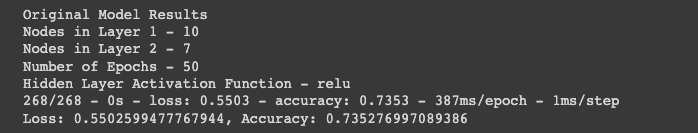
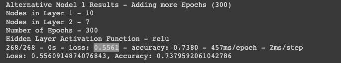
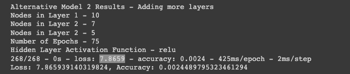
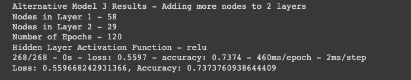
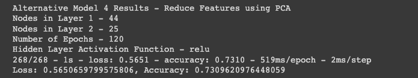
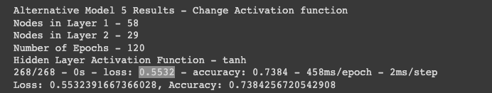

# Neural_Network_Venture_Capital_Startup_Funding
Alphabet Soup is a venture capital firm which receives many funding applications from startups for funding. Our data is a CSV containing information about the organizations that have received funding from Alphabet Soup over the years. A Binary classifier Neural Network model is created to help the company to predict whether an applicant will become a successful business.

The process is divided into following steps : 

* Prepare the data for use on a neural network model.

* Compile and evaluate a binary classification model using a neural network.

* Optimize the neural network model.

---
## Technologies

This application works on python 3.7 and uses following libraries:

* [tensorflow](https://www.tensorflow.org/) - TensorFlow makes it easy for beginners and experts to create machine learning models for desktop, mobile, web, and cloud. 

* [sklearn](https://scikit-learn.org/stable/getting_started.html) - Scikit-learn is an open source machine learning library that supports supervised and unsupervised learning. It also provides various tools for model fitting, data preprocessing, model selection, model evaluation, and many other utilities.

---

## Usage

Upload the **GC_venture_funding_with_deep_learning.ipynb** file in **[colab](https://colab.research.google.com/)** and start running the code. Upload the mentioned data files in the comment section of that code bloack located in **Resources** folder as and when the code block is executed.

---

## Prepare the Data for Use on a Neural Network Model

1. Read the `applicants_data.csv` file into a Pandas DataFrame.

2. Dropping the “EIN” (Employer Identification Number) and “NAME” columns from the DataFrame, because they are not relevant to the binary classification model.

3. The dataset's categorical variables are encoded using `OneHotEncoder` and stored in a new DataFrame with original DataFrame's numerical variables.

4. Using the preprocessed data, the features(`X`) and target (`y`) dataframes are created.

5. Training and testing datasets are created by splitting the features (`X`) and target (`y`).

6. Using `StandardScaler` to scale the features data.

---

## Compile and Evaluate a Binary Classification Model Using a Neural Network

A binary classification deep neural network model is created using TensorFlow and Keras. The model uses the dataset's features to predict whether an Alphabet Soup funded startup will be successful.

We followed the below steps:

1. A deep neural network is created using Tensorflow's Keras by assigning the number of input features(`116`), the number of layers(`2`), and the number of neurons on each layer(`10 in layer 1 and 7 in layer 2`). ( We use `relu` as the activation function for the hidden layers)

2. The model is then compiled and fit using the `binary_crossentropy` loss function, the `adam` optimizer, and the `accuracy` evaluation metric with `epochs=50`.

3. The model is evaluated using the test data to determine the model’s loss and accuracy.

    

4. The model is saved and exported to an HDF5 file named `AlphabetSoup.h5`.

---

## Optimize the Neural Network Model

The following models are created to optimize the original model's accuracy.

1. Model 1 - The number of Epochs are increased.
Nodes in Layer 1 -
Nodes in layer 2 - 
Number of Epochs - 
Activation Function for hidden nodes - 

   
   
2. Model 2 - Adding more layers.
Nodes in Layer 1 -
Nodes in layer 2 - 
Nodes in layer 3 - 
Number of Epochs - 
Activation Function for hidden nodes - 

   
   
3. Model 3 - 2 layers with additional nodes
Nodes in Layer 1 -
Nodes in layer 2 - 
Number of Epochs - 
Activation Function for hidden nodes - 

   
   
4. Model 4 - Changing Activation Function for hidden layers.
Nodes in Layer 1 -
Nodes in layer 2 - 
Number of Epochs - 
Activation Function for hidden nodes - 

   
   
5. Model 5 - Reducing number of inpuit features using PCA.
Nodes in Layer 1 -
Nodes in layer 2 - 
Number of Epochs - 
Activation Function for hidden nodes - 

   
   
---

## Saving the Alternate Neural Network Models
  All the alternate models are then saved in `Resources` folder.